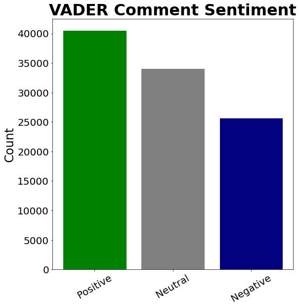
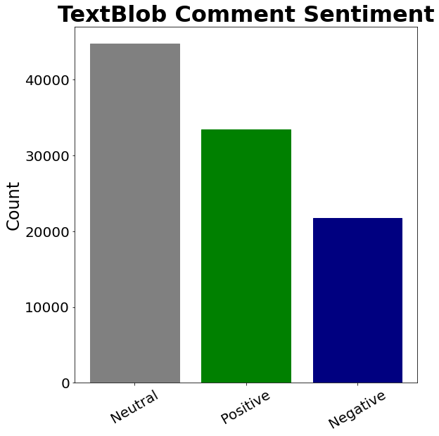
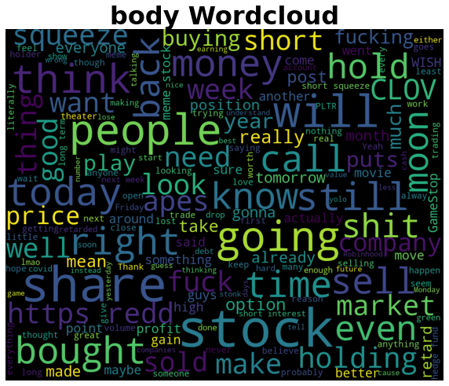
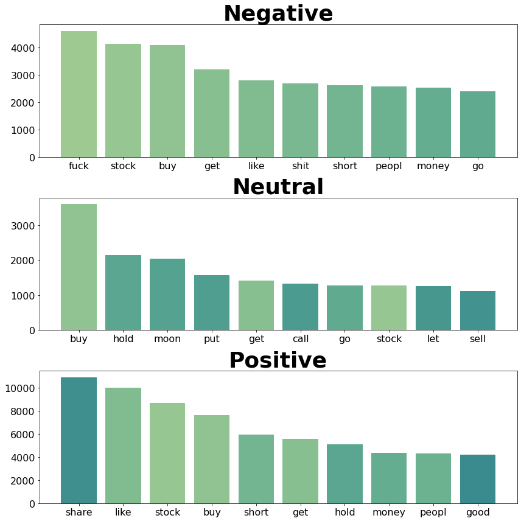
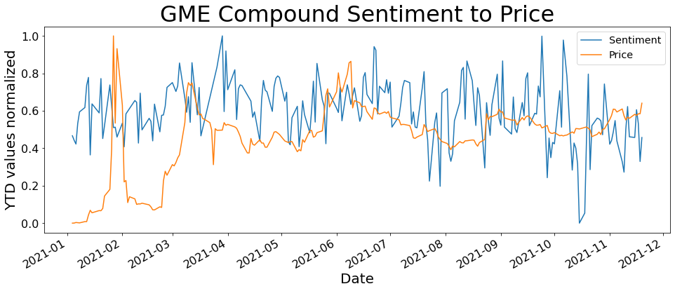
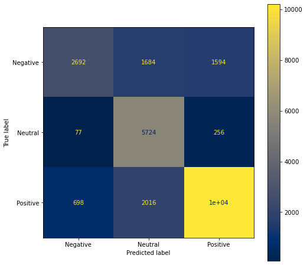
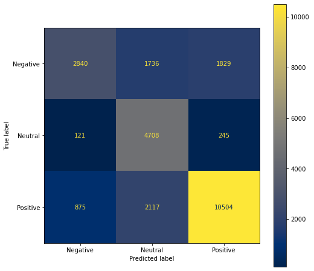
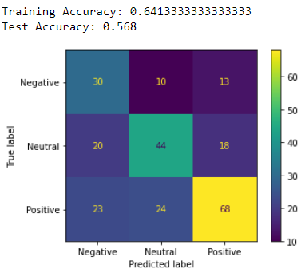

# Wallstreetbets Subreddit Sentiment Analysis

**Author**: [Doug Mill](mailto:douglas_mill@live.com)

## Overview 

Interest in the stock market has grown in the past few years, with COVID seemingly fueling some of the risk on behavior within markets. Last year, this increased interest crossed over into many other facets of our lives. With the convergence of reddit, social media, memes, the stock market, and mainstream media, the famed GameStop and AMC short squeezes captivated financial audiences in late January of this year. Through data science and research, we can take these newfound information sources and use them to benefit the broader retail trading audience.

## Business Understanding

My project is about stock sentiment in social media and how to best use this unstructed information. I am answering the question "Are wallstreetbets comments worth mining as an information source for stock analysis?". I am representing an independent asset management and research firm that was contacted by an international pension and sovereign wealth fund. Previously, they had only been subscribed to traditional market news. When the GME and AMC squeezes broke the news, the fund took notice. They have asked me to publish research about whether the wallstreetbets subreddit is worth mining as an information source and inquired about diversifying into meme stocks.

## Data Understanding

The data that was used for this project was exclusively scraped from the wallstreetbets subreddit of the social media platform Reddit. With the movement in stocks such as AMC and GME, things changed in the subreddit forever. How did these companies explode? The answer lies partially in shorts, gamma squeezing, and the wallstreetbets subreddit. In order to investigate, I scraped 100k comments containing the keyword "AMC" and 100k comments containing the keyword "GME" from wallstreetbets. **I decided to focus exclusively on the AMC comments for EDA and manual testing, but also did VADER sentiment analysis and supervised learning based on those labels, as well as sentiment score to price comparisons for GME.** The comments were posted between 1/1/21 and 11/20/21, when the project commenced. I used the PushShift API which does a great job with collected big amounts of data relative to the Reddit API. Previously I had used the official Reddit API with requests and PRAW.

I performed NLP Sentiment Analysis with VADER on all 100k comments and performed EDA on the results. I also did supervised learning using the VADER predicted sentiments as my labels and achieved 75% accuracy using XGBoost. As an alternative, I tried the textblob sentiment analyzer.




Some of the top words being used in general as well as in comments of various sentiments are included below:




## Data Preparation

For data preparation, I took my files straight from the API and then cleaned them out. I kept 6 relevant columns out of 40. These columns included "body" (actual comment), "score" (peer feedback), "total awards received" (peer feedback), "created utc" (date-time), "author", and "permalink" (kept these to verify legitimacy of comments). After cleaning out the irrelevant data, I cleaned the comments themselves. I then applied the default VADER for my time series data. This gave me positive, neutral, negative, and compound scores for each comment. I shipped these dataframes off to csvs. For the classification datasets known as "amc_modeling" and "gme_modeling", I tuned VADER by updating the lexicon with some new words and values. My full data engineering process can be found for both AMC and GME in the [appendix](./appendix) folder. The packages to reproduce this project can be found in the [environment file](./environment.yml).


After doing this, I wanted to train models on my own opinion of ground truth. I did also train models on the VADER labels [here](.appendix/AMC_modeling.ipynb). The only way to do this was to manually label the comments myself. I manually labeled 1000 comments each for AMC. After this, I compared my results to VADER and began to train my own machine learning models on my labels. The positive=bullish, neutral=neutral/can't tell/can't understand, negative=bearish. Here is the distribution of sentiments:


I am able to detect some degree on sarcasm since I'm reading the comments myself. Also I can access full thread context and can click on links. I also already understand what happened in a historical context fundamentally and from a price standpoint. However, I am confined by time and the amount of information I can process. These factors are what differentiated me from VADER in that I was able to understand the comments better but it took me alot longer to process them. Labeling comments really showed me how useful VADER is in general. As an alternative to VADER -- I tried using the Textblob sentiment analyzer for the comments as well. I also used VADER on my GME comments and was able to train models on those.

## Modeling

The rules that I followed when modeling included the following:
1. AMC Sentiment Only. Sentiments on other things such as other stocks, forum rules, other users, and trading styles were disregarded. <br>
2. Bullish=Positive, Neutral=Neutral, Bearish=Negative. Ex: When the person was excited about making money on shorts, it was still negative. Someone complaining about forum/audience is neutral about the stock. <br>

The preprocessing for VADER included converting comments to lowercase, removing "@" mentions between users, removing links, removing stopwords, and vectorizing. I also tested VADER without any preprocessing and it performed the same against my manually labeled data. Both VADER models were about 47% accurate as compared to my manual labels in a random sample of 1000 comments. The tuned one was slightly better at 47.4%. I then modeled AMC comments with classification techniques such as naive bayes, decision tree, random forest, and xgboost. I implemented pipelines and cross validation for each model. I used SMOTE to fix any slight class imbalances with minority oversampling. Naive Bayes was my early favorite and a solid, stable baseline model. Decision tree and xgboost were both decent but overfitting. Random Forest was also overfitting, but had potential for a high test score. Due to the constraints of my data, I went with the Naive Bayes model and this resulted in my highest test accuracy score of 57%.

I trained supervised learning models on my VADER predicted labels for all 100k AMC comments and 100k GME comments. **In total, I trained supervised learning models on 200k VADER predicted unstructured reddit comments with over 70% accuracy for both names.** Regarding AMC, I was able to achieve 75% accuracy with XGBoost and 71% accuracy with Naive Bayes. I also tried decision tree and random forest but they were overfitting. I was able to achieve 72% accuracy on the GME comments with XGBoost.

To take a closer look at the sentiment data, I have taken the unupdated VADER results and plotted them in a time series. I normalized the sentiments and stock price also. I then overlayed the chart with the stock price. I want to show the AMC graph, because it illustrates how sentiment can potentially be used as an indicator and supplement to your analysis. 




## Regression Results

The results for my VADER labeled comments were great. **For 200k comments -- I was able to achieve up to 75% accuracy with XGBoost in supervised learning. 75% for AMC and 72% for GME with 100k comments for each.




**My best performing model was XGBoost Classifier on 200k VADER predicted comments containing AMC and GME.**

The results of my secondary supervised learning done on 1000 of my own manually labeled comments is below. I achieved a 57% accuracy with Naive Bayes on those comments.




## Conclusion

The model did well classifying the sentiment of comments based on VADER. The alternative to using VADER labeling as my target would be manual labeling comments in a couple of 100k entry datasets. I ended up actually doing this for a 1000 comment random sample of AMC data. Given the evolving lingo as well as the sarcasm and context involved with each comment, there is no fool proof method including manual labeling. While I was reading the comments, I found myself between sentiments at times, often even considering all 3. The involvement of VADER in the bigger picture proves to be useful and reliable. I was able to reach 75% accuracy training a XGBoost classifier on the 100k AMC comment dataset that included all the VADER labels. This can be found in [this notebook](./appendix/AMC_modeling.ipynb). Detailed EDA into the VADER labeled 100k AMC comment dataset can be found [here](./appendix/AMC_EDA.ipynb).

Given the context of the business problem, a financial product based on NLP designed with the stakeholder as well as the broader audience is in my opinion the best way at this time to profit from the information on wallstreetbets. This financial product is an ETF named RSAH (reddit sentiment analysis holdings). It holds the top 10 most mentioned tickers on WSB for the past 30d period. The ETF will be rebalanced monthly with proprietary weighting.

Deployed my Streamlit app with Heroku [here](https://amcsentimentanalysis.herokuapp.com/).

## Future Research

Future work for this project includes manually labeling the GME comments and then training models based upon those labels. This would be tough work as well as tedious as many comments are quite subjective and interpretable in multiple ways.
Lastly, I would like to explore further in my time series work with NLP. I thought I was able to make good progress there. One thing I worked on was researching sentiment trends over time.

## References

WSB scraping tutorial, great summary: https://algotrading101.com/learn/reddit-wallstreetbets-web-scraping/ <br>
VADER paper: http://comp.social.gatech.edu/papers/icwsm14.vader.hutto.pdf <br>
NLP for trading: https://blog.quantinsti.com/natural-language-processing-trading/ <br>
Reddit API and Requests: https://towardsdatascience.com/how-to-use-the-reddit-api-in-python-5e05ddfd1e5c <br>
PushShift API: https://medium.com/swlh/how-to-scrape-large-amounts-of-reddit-data-using-pushshift-1d33bde9286 <br>
Lexicon upgrade for context: https://github.com/asad70/reddit-sentiment-analysis <br>
Plotly graphs: https://plotly.com/python/time-series/ <br>
API for WSB data: https://www.quiverquant.com/wallstreetbets/ <br>
Time Series with VADER: https://blog.quantinsti.com/vader-sentiment/ <br>
Deployment with Streamlit: https://www.youtube.com/watch?v=QetpwPnEpgA <br>
Using Streamlit with Heroku: https://gilberttanner.com/blog/deploying-your-streamlit-dashboard-with-heroku

## For More Information

See the full analysis in the [Jupyter Notebook](./Reddit_Sentiment_Analysis.ipynb) or review this [Presentation](./presentation.pdf).

For additional info contact [Doug Mill](mailto:douglas_mill@live.com).

## Repository Structure

```
├── appendix
├── data
├── images
├── .gitignore
├── README.md
├── Reddit_Sentiment_Analysis.ipynb
├── environment.yml
└── presentation.pdf
