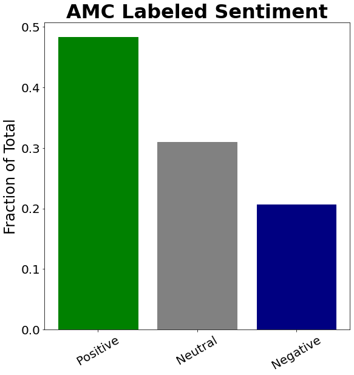
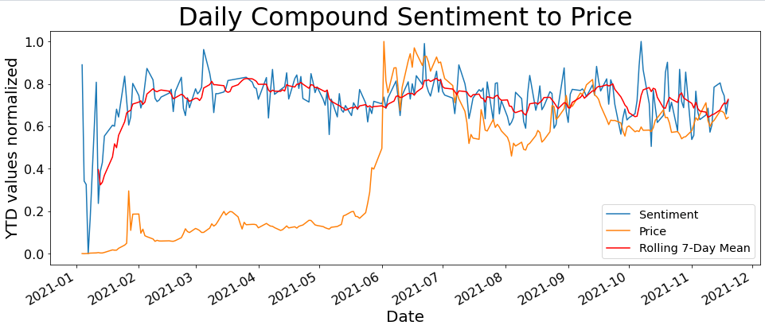

# Wallstreetbets Subreddit Sentiment Analysis

**Author**: [Doug Mill](mailto:douglas_mill@live.com)

## Overview 

Interest in the stock market has grown in the past few years, with COVID seemingly fueling some of the risk on behavior within markets. Last year, this increased interest crossed over into many other facets of our lives. With the convergence of reddit, social media, memes, the stock market, and mainstream media, the famed GameStop and AMC short squeezes captivated financial audiences in late January of this year. Through data science and research, we can take these newfound information sources and use them to benefit the broader retail trading audience.

## Business Understanding

I am representing an independent asset management and research firm that was contacted by an international pension and sovereign wealth fund. Previously, they had only been subscribed to traditional market news. When the GME and AMC squeezes broke the news, the fund took notice. They have asked me to publish research about whether the wallstreetbets subreddit is worth mining as an information source and inquired about diversifying into meme stocks. My goal here is to fulfill their needs efficiently and practically. I took a two-pronged approach to NLP; training classification models with a manually labeled sample as my target, and using NLP to find the top mentioned tickers on r/wsb. 

## Data Understanding

The data that was used for this project was exclusively scraped from the wallstreetbets subreddit of the social media platform Reddit. A subreddit is a subgroup of the platform dedicated to their own shared interest. In the case of wallstreetbets, that happens to be trading. When I first joined the group in 2019, directional single leg options were almost exclusively promoted. Shares were frowned upon. With the humungous movements in stocks such as GME and AMC, things changed in the subreddit forever. The popularity of the board skyrocketed, reaching mainstream appeal, and people were seeing huge gains in shares. What made these companies unique was that AMC was a company on the verge of bankruptcy. Gamestop was an outdated brick and mortar video game retailer. How did these companies explode? The answer lies partially in shorts, gamma squeezing, and the wallstreetbets subreddit. In order to investigate, I scraped 100k comments containing the keyword "AMC" and 100k comments containing the keyword "GME" from wallstreetbets. The comments were posted between 1/1/21 and 11/20/21, when the project commenced. I used the PushShift API which does a great job with collected big amounts of data relative to the Reddit API.

## Data Preparation

For data preparation, I took my files straight from the API and then cleaned them out. I kept 6 relevant columns out of 40. These columns included "body" (actual comment), "score" (peer feedback), "total awards received" (peer feedback), "created utc" (date-time), "author", and "permalink" (kept these to verify legitimacy of comments). After cleaning out the irrelevant data, I cleaned the comments themselves. I then applied the default VADER for my time series data. This gave me positive, neutral, negative, and compound scores for each comment. I shipped these dataframes off to csvs. For the classification datasets known as "amc_modeling" and "gme_modeling", I tuned VADER by updating the lexicon with some new words and values. My full EDA can be found for both AMC and GME in the appendix folder.

 

After doing this, I realized that I had to establish a ground truth target column. The only way to do this was to manually label the comments myself. I manually labeled 1000 comments each for AMC and GME data. After this, I compared my results to VADER and began to train my own machine learning models on my labels. The positive=bullish, neutral=neutral/can't tell/can't understand, negative=bearish. I am able to detect some degree on sarcasm since I'm reading the comments myself. Also I can access full thread context and can click on links. I also already understand what happened in a historical context fundamentally and from a price standpoint.
## Modeling

RULES: AMC Sentiment Only. Sentiments on other things such as other stocks, forum rules, other users, trading styles, etc. disregarded. Bullish=Positive, Neutral=Neutral, Bearish=Negative. Ex: When the person was excited about making money on shorts, it was still negative. Someone complaining about forum/audience is neutral about the stock. An issue I realized is that it is hard to detect sarcasm and sentiment in many cases without context.

The preprocessing for VADER included converting comments to lowercase, removing "@" mentions between users, removing links, removing stopwords, and vectorizing. I also tested VADER without any preprocessing and it performed the same against my manually labeled data. Both VADER models were about 47% accurate as compared to my manual labels in a random sample of 1000 comments. They can't account for context, sarcasm, etc.

Modeled AMC and GME comments with classification such as naive bayes, decision tree, random forest, and xgboost. Also implemented pipelines and cross validation for each model. Performed gridsearch on the random forest to try and improve it.

To take a closer look at the sentiment data, I have taken the unupdated VADER results and plotted them in a time series. I normalized the sentiments and stock price also. I then overlayed the chart with the stock price. I want to show the AMC graph, because it illustrates how sentiment can potentially be used as an indicator and supplement to your analysis.



## Regression Results

All the models besides Naive Bayes were overfitting severely. I ran count vectorizer, tfidf vectorizer, and SMOTE on them. I noticed when I was hand parsing the comments how difficult it was to classify them as a human so I don't blame the machine at all. I did naive bayes with a count vectorizer and tfidf vectorizer. The tfidf vectorizer came out better. Unfortunately, naive bayes doesn't have too many parameters. So far, my best model has been the untuned Naive Bayes sitting at 57% test accuracy. Random forest with smote and tfidf is a close second but is inconsistent also overfits. Xgboost is also close but has the same overfitting problem. When I ran a gridsearch on random forest and followed the parameters, the model didn't come out any better. It turns out the untuned naive bayes is the best.


## Conclusion

The model did well classifying the sentiment of comments based on VADER. The alternative to using VADER labeling as my target would be manual labeling of comments in a couple of 100k entry datasets. I ended up actually doing this for a 1000 comment random sample of AMC data. Given the evolving lingo as well as the sarcasm and context involved with each comment, there is no fool proof method including manual labeling. While I was reading the comments, I found myself between sentiments at times, often even considering all 3. The involvement of VADER in the bigger picture proves to be useful and reliable, however, I was able to beat it with my manually trained model.
Through iterative modeling, I was able to test out Naive Bayes, decision tree, random forest, and XGBoost. **Naive Bayes did great, resulting in a classification accuracy of 57%. VADER came up with 47% and random chance would have been about 33% as there are 3 categories.**
The best use of this model is to predict the sentiment of AMC comments. I will be deploying the model to a dashboard where users can do that. I would feel more comfortable applying this model to predict sentiments than I would with VADER or TextBlob, which I tried out in EDA but decided was inferior.
Given the context of the business problem, a financial product based on NLP designed with the stakeholder as well as the broader audience is in my opinion the best way at this time to profit from the information on wallstreetbets. This financial product is an ETF named RSAH (reddit sentiment analysis holdings). It holds the top 10 most mentioned tickers on WSB for the past 30d period. The ETF will be rebalanced monthly with proprietary weighting.

## Future Research

Future work for this project includes manually labeling the GME comments and then training models based upon those labels. This would be tough work as well as tedious as many comments are quite subjective and interpretable in multiple ways.
Lastly, I would like to explore further in my time series work with NLP. I thought I was able to make good progress there. One thing I worked on was researching sentiment trends over time. I started working with stacked LSTMs to predict price as well. My intuition would be that the viable way to proceed would be to refine the sentiment analyzer before fusing it with several layers of quantitative financial data in some type of neural network.
Obviously over the course of several years, this may progress to development and implementation of low latency algorithmic trading strategies integrating machine readable indicators such as NLP.

## References

WSB scraping tutorial, great summary: https://algotrading101.com/learn/reddit-wallstreetbets-web-scraping/
VADER paper: http://comp.social.gatech.edu/papers/icwsm14.vader.hutto.pdf
NLP for trading: https://blog.quantinsti.com/natural-language-processing-trading/
Reddit API and Requests: https://towardsdatascience.com/how-to-use-the-reddit-api-in-python-5e05ddfd1e5c
PushShift API: https://medium.com/swlh/how-to-scrape-large-amounts-of-reddit-data-using-pushshift-1d33bde9286
Lexicon upgrade for context: https://github.com/asad70/reddit-sentiment-analysis
Plotly graphs: https://plotly.com/python/time-series/
API for WSB data: https://www.quiverquant.com/wallstreetbets/
Time Series with VADER: https://blog.quantinsti.com/vader-sentiment/

## For More Information

See the full analysis in the [Jupyter Notebook](./Reddit_Sentiment_Analysis.ipynb) or review this [Presentation](./presentation.pdf).

For additional info contact [Doug Mill](mailto:douglas_mill@live.com).

## Repository Structure

```
├── appendix
├── data
├── images
├── .gitignore
├── README.md
├── Reddit_Sentiment_Analysis.ipynb
├── environment.yml
└── presentation.pdf
